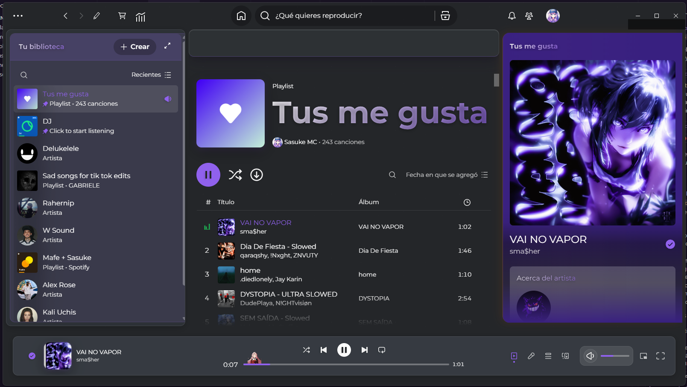
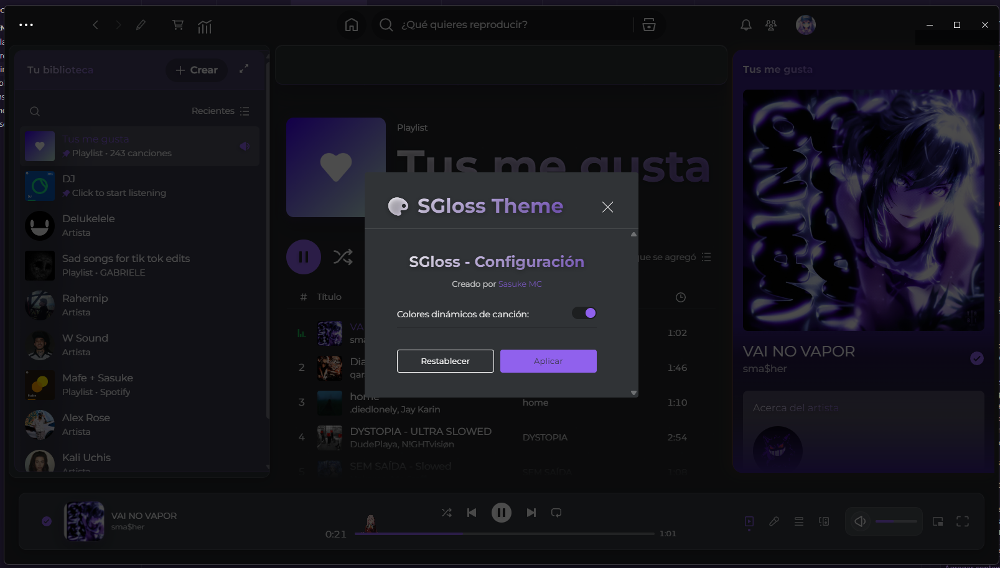

# SGlass Theme for Spicetify

A premium glass-inspired Spotify theme featuring dynamic colors, liquid glass effects, and sleek animations. SGlass combines modern design aesthetics with smooth performance optimizations.



## ✨ Features

- 🎨 **Dynamic Color Extraction** - Colors automatically adapt to your current song's artwork
- 🪟 **Liquid Glass Effects** - Beautiful backdrop blur and translucency throughout the interface
- ⚡ **Performance Optimized** - Smooth animations without compromising speed
- 🎵 **Clean Interface** - Minimalist design that puts your music first
- 🔧 **Easy Customization** - Simple configuration panel accessible from the top bar

## 📸 Preview

<details>
<summary>View Screenshots</summary>

### Main Interface


### Configuration Panel


</details>

## 📋 Dependencies

- **Spicetify** version 2.7.0 or newer (latest version always recommended)
- **Montserrat Font** - Automatically imported from Google Fonts
- Modern browser with backdrop-filter support (Chrome 76+, Firefox 103+, Safari 14+)

## 🚀 Installation

### Option 1: Automatic Installation (Recommended)

#### Windows (PowerShell)
```powershell
Invoke-WebRequest -UseBasicParsing "https://raw.githubusercontent.com/sasukemc77/sglass-spicetify/main/install.ps1" | Invoke-Expression
```

#### Linux/macOS (Bash)
```bash
curl -fsSL https://raw.githubusercontent.com/sasukemc77/sglass-spicetify/main/install.sh | sh
```

### Option 2: Manual Installation

1. **Download the theme**
   ```bash
   git clone https://github.com/sasukemc77/sglass-spicetify.git
   ```

2. **Copy to Spicetify themes folder**
   ```bash
   # Windows
   copy sglass-spicetify %USERPROFILE%\.spicetify\Themes\SGlass
   
   # Linux/macOS
   cp -r sglass-spicetify ~/.config/spicetify/Themes/SGlass
   ```

3. **Apply the theme**
   ```bash
   spicetify config current_theme SGlass
   spicetify config inject_css 1 replace_colors 1 overwrite_assets 1
   spicetify apply
   ```

### Option 3: Spicetify Marketplace

1. Install [spicetify-marketplace](https://github.com/spicetify/spicetify-marketplace)
2. Open Spotify and go to the Marketplace
3. Search for "SGlass" and click Install

## ⚙️ Configuration

### Theme Settings

Access the configuration panel by clicking the 🎨 button in the top bar. Available options:

- **Dynamic Colors**: Automatically extract colors from song artwork
- **Custom Color**: Choose a manual accent color when dynamic colors are disabled

### Advanced Customization

You can modify the theme by editing the `user.css` file:

```css
:root {
  --glass-blur: 15px;          /* Blur intensity */
  --glass-opacity: 0.6;        /* Background opacity */
  --glass-saturation: 1.2;     /* Color saturation */
  --transition: 0.15s;         /* Animation speed */
}
```

## 🔧 Important Setup

For optimal experience, ensure your Spicetify configuration includes:

```ini
[Setting]
spotify_path = /path/to/spotify
prefs_path = /path/to/prefs
current_theme = SGlass
inject_css = 1
replace_colors = 1
overwrite_assets = 1

[Patch]
xpui.js_find_8008 = ,(\w+=)32,
xpui.js_repl_8008 = ,${1}56,
```

## 🎨 Color Schemes

SGlass dynamically adapts to your music, but you can also set custom colors:

- **Dynamic Mode**: Colors extracted from album artwork (default)
- **Custom Mode**: Set your preferred accent color
- **Automatic Fallback**: Uses theme default if color extraction fails

## 🐛 Troubleshooting

### Theme not applying
```bash
spicetify backup apply
```

### Colors not changing
- Ensure "Dynamic Colors" is enabled in the theme settings
- Check that you're playing music with album artwork

### Performance issues
- Disable advanced animations in low-performance systems
- Reduce blur intensity in the CSS variables

## 🔄 Updates

To update SGlass to the latest version:

```bash
# Automatic update (if installed via script)
spicetify upgrade-theme sglass

# Manual update
git pull origin main
spicetify apply
```

## 📝 Changelog

### v1.0.0 (2025-09-20)
- Initial release
- Dynamic color extraction
- Liquid glass effects
- Performance optimizations
- Simple configuration panel

## 🤝 Contributing

Contributions are welcome! Please feel free to submit a Pull Request. For major changes, please open an issue first to discuss what you would like to change.

## 📄 License

This project is licensed under the MIT License - see the [LICENSE](LICENSE) file for details.

## 👨‍💻 Credits

**Created by [Sasuke MC](https://sasukemc77.com)**

### Inspiration
- Based on modern glass design principles
- Inspired by Windows 11 Fluent Design
- Color extraction techniques from various open-source projects

### Fonts
- **Montserrat** by Julieta Ulanovsky (Google Fonts)

### Special Thanks
- Spicetify community for the amazing platform
- Beta testers for valuable feedback

---

<div align="center">

**[Website](https://sasukemc77.com)** • **[Portfolio](https://sasukemc77.com)** • **[Report Issues](https://github.com/sasukemc77/sglass-spicetify/issues)**

Made with ❤️ by Sasuke MC

</div>